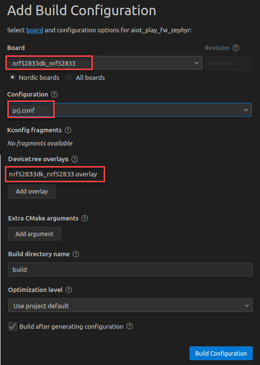
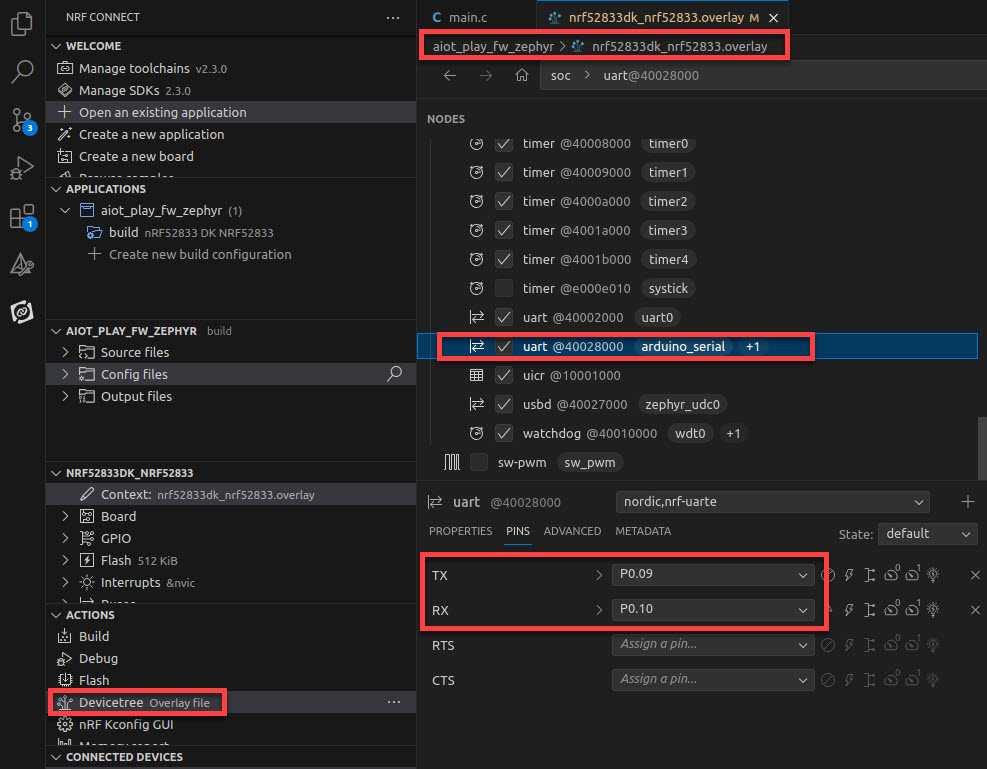

# AIOT Zephyr Application which uses Memfault for Performance Monitoring


## Project information

In this project we present an Application Performance Monitoring (APM) framework for the AIOT Board.
Therefore, we implement a sample Zepyhr application which uses Memfault.<br>
The application periodically sends out "Memfault chunks" via the SmartMesh IP chip.<br>
These chunks arrive at the SmartMesh IP manager, which is connected to an Edge Device, from where they are posted to the Memfault cloud.
This README file will guide through the following steps:
- Setup nRF Connect SDK (NCS) and nrfjprog
- Clone Repository and Import into NCS
- Connect and Program AIOT
- AIOT Network Joining Process
- Applications on the Edge Device
- Observe incoming Memfault Chunks at Memfault Cloud


## Setup nRF Connect SDK (NCS) and nrfjprog

### NCS
The nRF Connect SDK (NCS) can be downloaded at:
https://developer.nordicsemi.com/nRF_Connect_SDK/doc/latest/nrf/installation/assistant.html

The NCS is available as VS Code extension after installation.
Thus, the version of the NCS, toolchains and Zephyr can be updated inside VS code.


### nrfjprog
The nRF Command Line Tools can be downloaded at:
https://www.nordicsemi.com/Products/Development-tools/nrf-command-line-tools/download

If using the build, flash and debug functions of the NCS, check if the nrfjprog command line tool is installed by typing the command in your terminal:

```
nrfjprog -v
```

**Note**: In this tutorial we used:
- NCS version v.2.3.0 and Toolchain version v.2.3.0
- Command Line Tool versions:
```
nrfjprog -v
>> nrfjprog version: 10.21.0 external
>> JLinkARM.dll version: 7.80
```


## Clone Repository and Import into NCS

Clone Repository:
```
git clone git@github.com:aiotsystems/aiot_play_fw_zephyr.git
```

Import in NCS:


Create Build Configuration:



The FW is then built in:


## Connect and Program AIOT

### Setup
One can use another nRFXX-DK with on-board J-LINK debugger for programming the AIOT.


After plugging batteries into the AIOT and connecting the debugger to the PC, the AIOT should appear in the NCS under Connected Devices:


### Program

Although, we have used the provided overlay file for the build configuration, check if the UART Pins appear correctly in the Device tree:




In the prj.conf file, paste the Memfault Cloud project key:


### Re-Build and Flash


## AIOT Network Joining Process

Plug-in the Manager into your computer and connect to serial API (thrid COM-Port in Windows):


Then login to the serial API by typing:
```
login user
```
Then you can watch the AIOT network join Process by iteratively issueing the show mote command:
```
sm
```
Finally the AIOT will appear in Operating (Oper) state.


## Applications on the Edge Device

At the Edge Device we receive the heartbeats and push them to the Memfault Cloud.

### JsonServer

The SmartMesh IP Manager is connected via USB to the Edge Device.<br>
The JSon Server.py
https://github.com/dustcloud/smartmeshsdk/tree/master/app/JsonServer

Venv

Then start:


### Node-RED (optional)
In this tutorial, we do not build up on Node-RED but can use it for debugging purposes.<br>
Thus, this section is optional.<br>
Node-RED is a flow-based programming tool for wiring together hardware devices, APIs
and online services.<br>
Node-RED can be either be installed via node-js:<br>
https://nodejs.org/en<br>
by using the Node Package Manager (npm):
```
npm install -g --unsafe-perm node-red
```
Then start Node-RED at port 1880 by typing:
```
node-red
```
Alternatively, Node-RED can be run as a Docker container via the command:
```
docker run -it -p 1880:1880 -v node_red_data:/data --name mynodered nodered/node-red
```
When opening http://127.0.0.1:1880/..


### Memfault CLI

The Memfault CLI is a Python package offering different kinds of interaction with the Memfault cloud via the command line.<br>
In this repository there is a Python script called smip_to_memfault_exporter.py in the python folder.<br>
The script listens to HTTP port 1880, grabs the Memfault chunks and pushes to Memfault Cloud via the Memfault CLI.<br>
To run the script, install Python 3.9 and the Memfault CLI.

#### Windows
By using for example anaconda: <br>
```
conda create --name smip-to_memfault python=3.9
conda activate smip-to_memfault
pip3 install memfault-cli
```

#### Linux
By using for example venv: <br>
```
python -m venv smip_to_memfault_venv
source smip_to_memfault_venv/bin/activate
pip3 install memfault-cli
```

Before you run the script, insert the project_key from the Memfault cloud into smip_to_memfault_exporter.py:
```
project_key = "***************************"
```

## Observe incoming Memfault Chunks at Memfault Cloud

Bla bla


Bla bla

